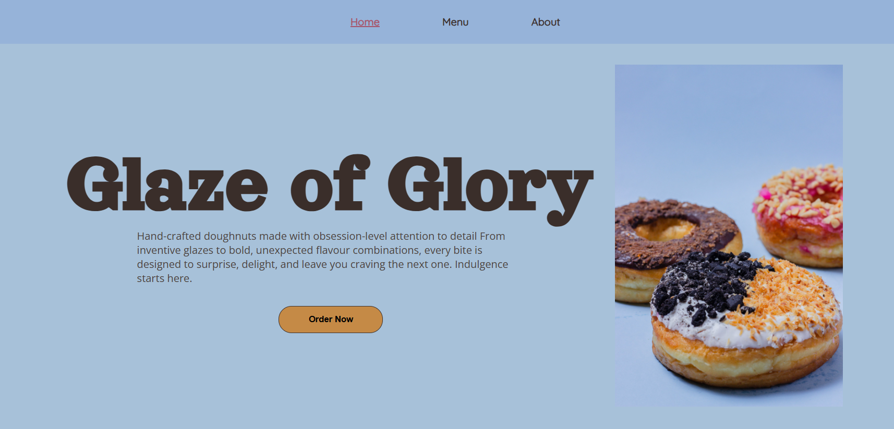

# Restaurant Page
Simple restaurant page created primarily using JavaScript. 

This is part of [The Odin Project's Full Stack Javascript path](https://www.theodinproject.com/paths/full-stack-javascript) and demonstrates the use of webpack for bundling, dynamic page rendering instead of static HTML, and DOM manipulation.

## Screenshot


## Installation
1. Clone the repository
2. Navigate to the project folder: ```cd restaurant```
3. Open index.html in any modern browser

## Features
- Dynamic page rendering
- Modular JavaScript structure
- Webpack asset bundling
- Custom CSS Styling

## Technologies
- HTML5
- CSS (custom styling)
- JavaScript (dom manipulation, module pattern, event delegation)

## Fonts
- [Open Sans](https://fonts.google.com/specimen/Open+Sans)
- [Orelega One](https://fonts.google.com/specimen/Orelega+One)
- [Quicksand](https://fonts.google.com/specimen/Quicksand)

## Images
- Donut hero: [Nerfee Mirandilla on Unplash](https://unsplash.com/photos/chocolate-donuts-hzqE4zC6j-E?utm_source=unsplash&utm_medium=referral&utm_content=creditCopyText)
- Donut display: [Andrew Solok 🇺🇦 on Unsplash](https://unsplash.com/photos/a-display-of-various-pastries-q2MLS6yGmzE?utm_source=unsplash&utm_medium=referral&utm_content=creditCopyText)

